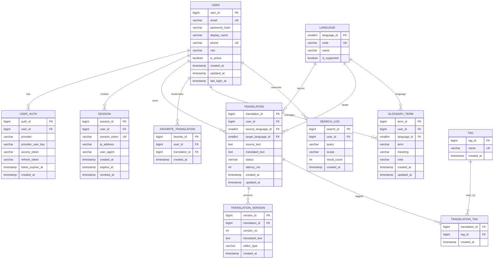

## 프로젝트 개요
### 1.1 목표
본 프로젝트는 모바일 퍼스트 기준의 정적 랜딩 페이지를 HTML·CSS 중심으로 구현하는 퍼블리싱 프로젝트이다. 디자인 시안 기반으로 구조 설계, 레이아웃 구현, 컴포넌트 분리를 단계적으로 진행하며, 실제 실무 퍼블리싱 프로세스를 그대로 재현하는 것을 목표로 한다.

시맨틱 마크업을 기본 원칙으로 header, main, section, footer 구조를 명확히 구분하고, 접근성을 고려한 heading 구조, visually-hidden 처리, 적절한 alt 텍스트와 ARIA 속성을 적용한다. 클래스 네이밍은 BEM 컨벤션을 사용해 역할과 책임이 드러나도록 설계한다.

CSS는 reset, base, layout, main, components 단위로 분리하여 관리하며, 전역 디자인 토큰을 변수로 정의해 색상·타이포그래피·간격의 일관성을 유지한다. 레이아웃은 flexbox를 중심으로 구성하고, 미디어 쿼리를 통해 PC 환경까지 자연스럽게 확장 가능한 구조를 만든다.

---

### 1.2 주요 기능

- 모바일 퍼스트 반응형 레이아웃 구현
모바일 기준으로 구조를 설계하고 미디어 쿼리를 통해 PC 환경까지 확장한다. 동일한 마크업을 유지한 채 레이아웃만 전환되도록 구성한다.

---

- 시맨틱 마크업 및 문서 구조 확보
header, main, section, footer를 명확히 구분한다. 
<table>
  <tr>
    <td>
      <div style="display: flex; justify-content: center;">
        
      </div>
    </td>
    <td>
      <div style="display: flex; justify-content: center;">
        
      </div>
    </td>
  </tr>
</table>

---

- 접근성 대응 


    ```HTML
    .visually-hidden{
        position: absolute; (문서 흐름에서 제거)
        width: 1px; (화면에 보이지 않도록 렌더 영역을 극소화)
        height: 1px;
        padding: 0; (초기화, 영역 생기는 것 방지)
        margin: -1px; (1px 영역조차 화면에 남지 않도록)
        overflow: hidden; (박스 밖에서도 보이지 않게)
        clip: rect(0, 0, 0, 0); (시각적으로 완전 비노출 상태)
        white-space: nowrap; (줄바꿈으로 인해 렌더링 영역이 생기는 것을 방지)
        border: 0; (테두리 방지)
    }
    ```

   visually-hidden 헤딩, 의미 있는 alt 텍스트, ARIA 속성을 적용해 접근성을 확보 한다.


---

 BEM 기반 클래스 네이밍


   블록·엘리먼트·모디파이어 역할이 드러나도록 네이밍한다. 스타일 충돌을 방지하고 유지보수를 용이하게 한다.


---

- CSS 레이어 분리 구조


link 태그로 외부 CSS파일 연결
reset, base, layout, main, components 단위로 CSS를 분리한다. 전역 변수로 디자인 토큰을 관리해 일관성을 유지한다.
브라우저가 각 CSS 파일을 병렬로 요청·캐싱
초기 로딩과 재방문 성능이 안정적
 파일 단위로 책임이 분리되어 역할 경계가 명확해지고, 변경 영향 범위가 예측 가능합니다.
 DevTools에서 파일별로 규칙을 추적하기 쉬워 디버깅과 유지보수가 수월합니다.

 ---  

- 히어로·프로필·갤러리·구독 섹션 구현


각 섹션을 독립적인 레이아웃 단위로 구성한다. 섹션별 제목, 콘텐츠, 버튼 구조를 명확히 분리한다.
필요에 따라 레이아웃 배치를 위해 컨테이너를 추가한다.

---

- 네비게이션 드로어
모바일 환경에서 햄버거 버튼을 통해 슬라이드형 네비게이션을 제공한다. PC 환경에서는 헤더 네비게이션으로 전환된다.

---

- 모달 컴포넌트
body 직속 레이어 구조로 모달을 구현한다. 배경 차단, 포커스 흐름 제어를 고려한 구조를 적용한다.

---

- 공용 버튼 컴포넌트


디자인과 인터랙션이 동일한 버튼을 컴포넌트화한다. 섹션별로 재사용 가능하도록 설계한다.

---

- Git 커밋 단위 기록 방식


각 작업을 하나의 커밋 단위로 관리한다. 이슈, 원인, 해결 과정, 코드 변경 내용을 문서화해 기록 자산으로 남긴다.

---

- 정적 퍼블리싱 중심 구조
JavaScript 의존 없이 HTML·CSS 중심으로 완성한다. 이후 인터랙션 확장이 가능하도록 구조적 여지를 남긴다.

---

### 1.3 팀 구성

<table style="width:100%; border-collapse:collapse;">
    <tbody>
        <tr>
            <td style="text-align:center; vertical-align:middle; height:3rem;">
                이현규
            </td>
            <td style="text-align:center; vertical-align:middle; height:3rem;">
                위니브 스승님
            </td>
            <td style="text-align:center; vertical-align:middle; height:3rem;">
                GPT
            </td>
        </tr>
        <tr>
            <td style="padding:0; height:200px;">
                
            </td>
            <td style="padding:0; height:200px;">
                
            </td>
            <td style="padding:0; height:200px;">
                
            </td>
        </tr>
    </tbody>
</table>


본 프로젝트는 개인 단독 개발을 중심으로 진행되었으며, 설계 방향과 구현 과정에서 멘토진의 조언을 참고하였다. 개발 전반에서는 GPT를 활용해 구조 검토, 문제 해결, 문서 정리를 보조 도구로 활용하였다.

---
## 개발 환경 및 배포

### 2.1 개발 환경
- HTML5, CSS3 (Semantic Markup)
- VS Code

### 2.2 배포 URL
- https://lhk0721.github.io/MiniProject-02/

---

## 요구사항 명세 및 기능 명세


---


---


---


## 프로젝트 구조 및 개발 일정
4.1 프로젝트 구조
```
MiniProject-02/
├─ index.html
├─ README.md
│
├─ img/
│  ├─ arrow-left.svg
│  ├─ arrow-right.svg
│  ├─ blog.svg
│  ├─ box-cat.png
│  ├─ cat-subscribe.png
│  ├─ facebook.svg
│  ├─ img_1.jpg
│  ├─ img_2.jpg
│  ├─ img_3.jpg
│  ├─ img_4.jpg
│  ├─ img_5.jpg
│  ├─ instagram.svg
│  ├─ logo.png
│  ├─ logo.svg
│  ├─ mail.svg
│  ├─ main.png
│  ├─ menu.svg
│  ├─ Miniproject-02.html
│  ├─ modal-bg-img.png
│  ├─ nos_down.exe
│  ├─ top-btn.svg
│  └─ youtube.svg
│
├─ src/
│
└─ style/
   ├─ reset.css
   ├─ base.css
   ├─ componenets.css
   ├─ components-temp.css
   ├─ layout.css
   ├─ layout-temp.css
   ├─ main.css
   └─ main-temp.css

```


### 4.2 개발 일정(WBS)

---

## 와이어프레임 / UI / BM
###  와이어프레임, 화면 설계, 메인 기능 설명


<table style="width:100%; border-collapse:collapse;">
<tbody>
 <tr>
     <td style="padding:10px 12px; text-align:left; vertical-align:middle; font-size:14px; line-height:1.6;">
         MiniProject02-HODU<br>
         화면 구성의 방향성과 주요 UI 흐름을 빠르게 공유하기 위한 초안입니다. 각 화면은 후속 퍼블리싱 및 기능 구현의 기준으로 사용합니다.
     </td>
 </tr>

 <tr>
     <td style="padding:8px 12px; text-align:center; vertical-align:middle; height:3rem; font-weight:600;">
         Main-PC
     </td>
 </tr>
 <tr>
     <td style="padding:0; height:800px;">
         
     </td>
 </tr>

 <tr>
     <td style="padding:8px 12px; text-align:center; vertical-align:middle; height:3rem; font-weight:600;">
         modal
     </td>
 </tr>
 <tr>
     <td style="padding:0; height:400px;">
         
     </td>
 </tr>

 <tr>
     <td style="padding:8px 12px; text-align:center; vertical-align:middle; height:3rem; font-weight:600;">
         Main-mobile
     </td>
 </tr>
 <tr>
     <td style="padding:0; height:3500px;">
         
     </td>
 </tr>

 <tr>
     <td style="padding:8px 12px; text-align:center; vertical-align:middle; height:3rem; font-weight:600;">
         Navigation-drawer
     </td>
 </tr>
 <tr>
     <td style="padding:0; height:1000px;">
         
     </td>
 </tr>
</tbody>
</table>

---

### 데이터베이스 모델링(ERD)



---

### 아키텍처 설계


### 에러 및 트러블슈팅


